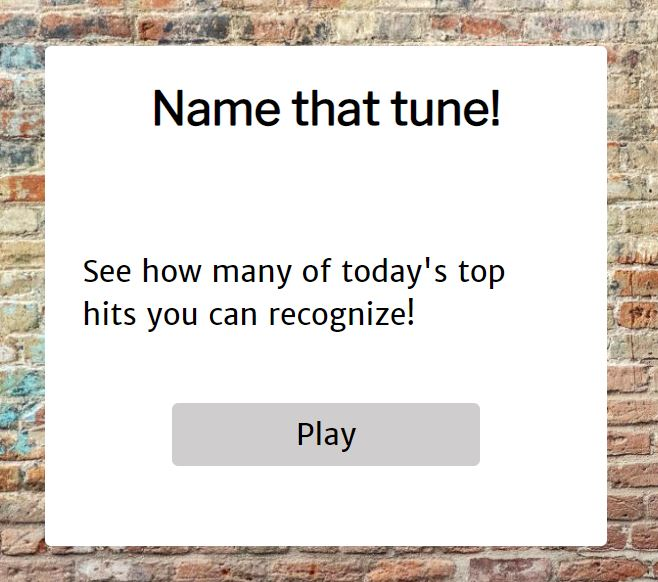
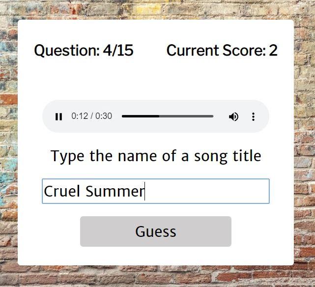
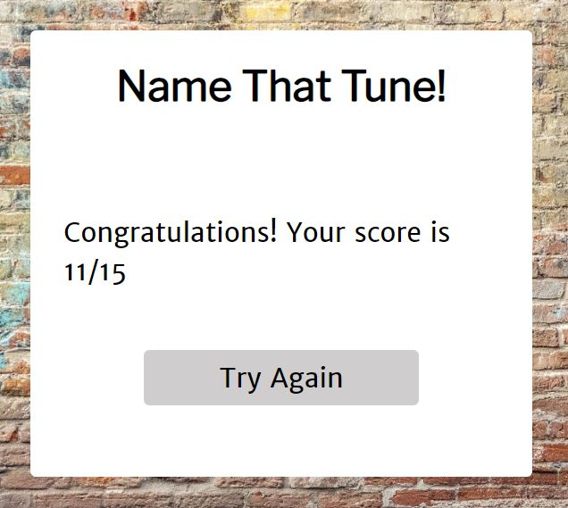

# Name That Tune

## Summary
Name That Tune is a game for determining how many of today's top hits the user can recognize. A 30-second preview of a song will be played, and the user is prompted to guess the song's title. App features 2 modes of play:
* Causal - user is pitched songs infinitely and score is not kept
* Challenge - user is pitched 15 songs and scored for accuracy

## API Integrations
* Last.fm (used to fetch today's current hits)
* Deezer (used to fetch song previews)

## Technologies 
* HTML5
* CSS
* JavaScript 
* jQuery

## Screenshots

## Demo
* https://ergarner11.github.io/name-that-tune/
